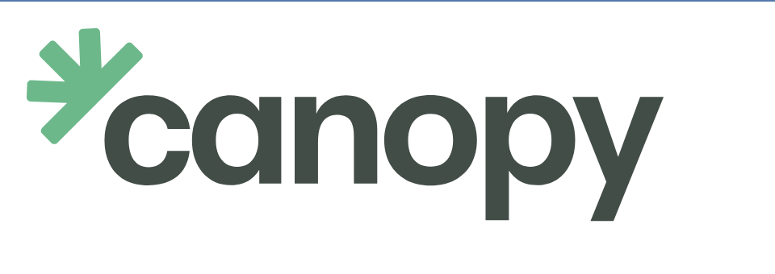

# Bennett Davis

**Head of Growth** &nbsp;·&nbsp; [**Amplifi Liquidity**](https://amplifi.xyz)  
Building [**Aegis Markets**](https://aegis.markets)

DeFi market-making &nbsp;·&nbsp; AMM mechanics &nbsp;·&nbsp; Liquidity infrastructure &nbsp;·&nbsp; TGE design

CS + Applied Math, [Vanderbilt](https://www.vanderbilt.edu/) — May 2026

 

---

## Currently Building

<table>
<tr>
<td width="260" align="center" valign="middle">
  
</td>
<td valign="middle">

### [Amplifi Liquidity](https://amplifi.xyz)
*DeFi market-making and liquidity infrastructure*

Leading growth and BD across four service lines:
- **Treasury Activation** — putting protocol treasuries to productive work
- **DEX Market Making** — concentrated liquidity on v3/v4 venues
- **Vault Strategy** — yield across lending, LP, and structured products
- **TGE Support** — launch-day liquidity and market structure for new tokens

</td>
</tr>
<tr>
<td width="260" align="center" valign="middle">
  
</td>
<td valign="middle">

### [Aegis Markets](https://aegis.markets)
*Uniswap V4 hook protocol*

Novel hook architecture for capital-efficient market making. Building out **AEGIS Engine** — the introduction of margin to Uniswap.

</td>
</tr>
</table>

---

## Track Record

<table>
<tr>
<td width="260" align="center" valign="middle">
  
</td>
<td valign="middle">

### [Canopy](https://app.canopyhub.xyz)
*DeFi liquidity protocol on Movement Network — Co-founder*

  
  
  
  

</td>
</tr>
<tr>
<td width="260" align="center" valign="middle">
  
</td>
<td valign="middle">

### [Movement Labs](https://movementlabs.xyz)
*Move-based L2 — Founding team*

From inception through institutional rounds:

  
  

</td>
</tr>
</table>

### Earlier

**NASA × Vanderbilt** — blockchain research on proof-of-stake drone coordination (Hedera Hashgraph).

---

## Focus Areas

  
  
  
  
  
  

DeFi infrastructure · AMM mechanics (v3 concentrated liquidity, v4 hooks) · liquidity management · market making · tokenomics and TGE design.

---

<a href="mailto:bennett@amplifiliquidity.com">bennett@amplifiliquidity.com</a>

